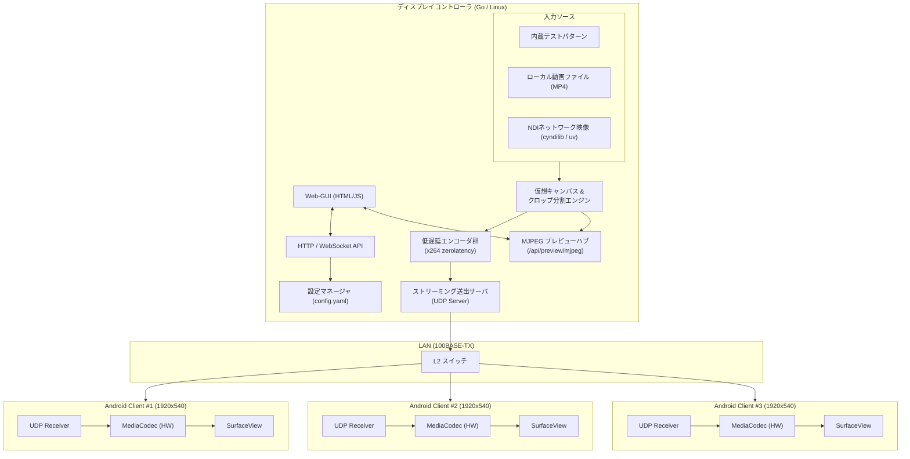

# アーキテクチャ設計書 (Architecture Design)

本書では、連接ブースディスプレイシステム booth-display の全体アーキテクチャおよびコントローラの実装方針について記述します。

---

## 1. 全体システムアーキテクチャ

システムは以下の主要コンポーネントで構成されます。

---

## 2. ディスプレイコントローラ内部設計 (`controller/`)

### (1) パイプライン構成
- 入力ソース処理:
  - 内蔵テストパターン（FFmpeg lavfi testsrc）
  - ローカル動画ファイル（MP4 / H.264）
  - NDIネットワーク映像（Python cyndilib / uv による rawvideo パイプ受信）
- キャンバス分割 (Crop / Slicing):
  - 仮想キャンバス全体のフレームから、各ディスプレイの設定座標（X, Y, W, H）に従ってサブ矩形を抽出。
  - ベゼル（額縁）補正分を考慮したオフセット計算を適用。
- 個別エンコード & パケット化:
  - 切り出した各画面のフレームを低遅延エンコーダ（CPU x264 preset=ultrafast, tune=zerolatency）へ投入。
  - Annex-B H.264 NALユニットを16バイトのカスタムヘッダ付きUDPパケットにフラグメント分割。
- UDP送出:
  - 宛先ディスプレイのIPおよびポートへ非同期UDP送出。

### (2) Web-GUI & API管理
- Web-GUI (`controller/frontend/`):
  - Vue 3 (Composition API / `<script setup>`) + Vite + Tailwind CSS を採用。
  - TechnoTUTデザインシステムに準拠し、ダーク/ライトテーマに対応。
  - Viteビルド成果物 (`controller/web/dist`) をGoの `embed.FS` により単一バイナリ内に完全同梱。
  - ディスプレイの接続状況モニタリング（WebSocket経由でのリアルタイムFPS・ビットレート・ドロップ率可視化）。
  - 仮想キャンバスのトポロジー表示、ライブMJPEGプレビュー、クロップ枠オーバーレイ。
  - 設定テーブルからのIP、ポート、解像度、クロップ位置、ベゼル幅の動的編集と保存。
- WebSocket制御チャンネル:
  - クライアントおよびWeb-GUIとの双方向通信、毎秒のテレメトリ配信、再生同期コマンドの通知。

### (3) NDIブリッジ連携
- `controller/scripts/ndi_bridge.py`:
  - Pythonの `cyndilib` を使用してNDIソースの自動検出およびフレーム受信を実行。
  - コントローラ本体からは `uv run` 経由で呼び出し、キャンバス解像度にスケーリングされたrawvideoストリームをUNIXパイプ経由でGoパイプラインへ供給。

---

## 3. Androidクライアント内部設計 (`android-client/`)

- 動作環境: Android 7.1 (API 25), ARM Cortex-A17 4Core, 1GB RAM
- 役割:
  - UDPパケットの受信とフラグメント再構築
  - MediaCodecによるハードウェアH.264デコード（Cortex-A17 VPU活用）
  - SurfaceViewによるフルスクリーン描画（イマーシブモード）
