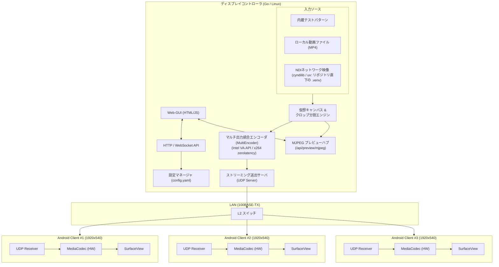

# アーキテクチャ設計書 (Architecture Design)

本書では、連接ブースディスプレイシステム booth-display の全体アーキテクチャおよびコントローラの実装方針について記述します。

---

## 1. 全体システムアーキテクチャ

システムは以下の主要コンポーネントで構成されます。

---

## 2. ディスプレイコントローラ内部設計 (`controller/`)

### (1) パイプライン構成
- 入力ソース処理:
  - 内蔵テストパターン（Go ネイティブ生成）
  - ローカル動画ファイル（MP4 / H.264）
  - NDIネットワーク映像（Python cyndilib / uv による rawvideo パイプ受信）
- 仮想キャンバスミキサー (`CanvasMixer`):
  - 30fpsの一定周期でフレームを合成・トランジション（カット、クロスフェード、黒転換）処理。
  - バッファプール（`sync.Pool`）と参照カウント方式により、購読者ごとのメモリコピーを排除（ゼロコピー配信）。
- 単一プロセス統合エンコード (`MultiEncoder`):
  - 1つのFFmpegプロセスに全体キャンバス (5760x540) の rawvideo を1系統のみ入力。
  - `split` および `crop` フィルタで各ディスプレイ領域へ分割。
  - **ハードウェア支援 (Intel VA-API)**: `/dev/dri/renderD128` が利用可能な場合、`format=nv12,hwupload` を経由して `h264_vaapi`（Constrained Baseline, AUD有効, Bフレームなし）で低遅延・超低CPU負荷エンコード。
  - **ソフトウェアフォールバック**: VA-API 非搭載または初期化失敗時は自動で `libx264`（ultrafast, zerolatency）にフォールバック。
  - 各画面の出力は追加パイプディスクリプタ (`pipe:3`, `pipe:4`, ...) 経由で独立ゴルーチンへ送出。
- パケット化 & UDP送出:
  - Annex-B H.264 NALユニットを解析し、Access Unit (フレーム) 単位で16バイトのカスタムヘッダ付きUDPパケットにフラグメント分割。
  - 宛先ディスプレイのIPおよびポートへ非同期UDP送出。

### (2) Web-GUI & API管理
- Web-GUI (`controller/frontend/`):
  - Vue 3 (Composition API / `<script setup>`) + Vite + Tailwind CSS を採用。
  - TechnoTUTデザインシステムに準拠し、ダーク/ライトテーマに対応。
  - Viteビルド成果物 (`controller/web/dist`) をGoの `embed.FS` により単一バイナリ内に完全同梱。
  - ディスプレイの接続状況モニタリング（WebSocket経由でのリアルタイムFPS・ビットレート・ドロップ率可視化）。
  - 仮想キャンバスのトポロジー表示、ライブMJPEGプレビュー、クロップ枠オーバーレイ。
  - 設定テーブルからのIP、ポート、解像度、クロップ位置、ベゼル幅の動的編集と保存。
- WebSocket制御チャンネル:
  - クライアントおよびWeb-GUIとの双方向通信、毎秒のテレメトリ配信。

### (3) NDIブリッジ連携
- `controller/scripts/ndi_bridge.py`:
  - Pythonの `cyndilib` を使用してNDIソースの自動検出およびフレーム受信を実行。
  - コントローラ本体からはリポジトリ直下の uv プロジェクト (`pyproject.toml` / `.venv`、`make setup-python` で作成) を `uv run --project .` で参照して呼び出し (コントローラはリポジトリ直下から起動する必要がある)、キャンバス解像度にスケーリングされたrawvideoストリームをUNIXパイプ経由でGoパイプラインへ供給。

---

## 3. Androidクライアント内部設計 (`android-client/`)

- 動作環境: Android 7.1 (API 25), ARM Cortex-A17 4Core, 1GB RAM
- 役割:
  - UDPパケットの受信とフラグメント再構築
  - MediaCodecによるハードウェアH.264デコード（Cortex-A17 VPU活用）
  - SurfaceViewによるフルスクリーン描画（イマーシブモード）
